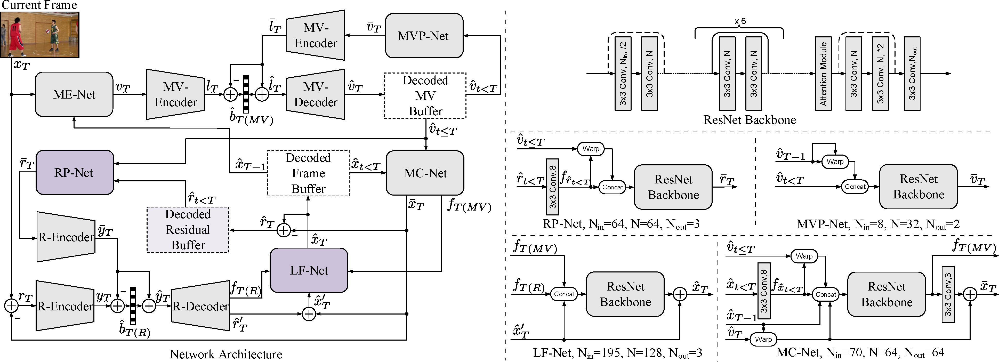
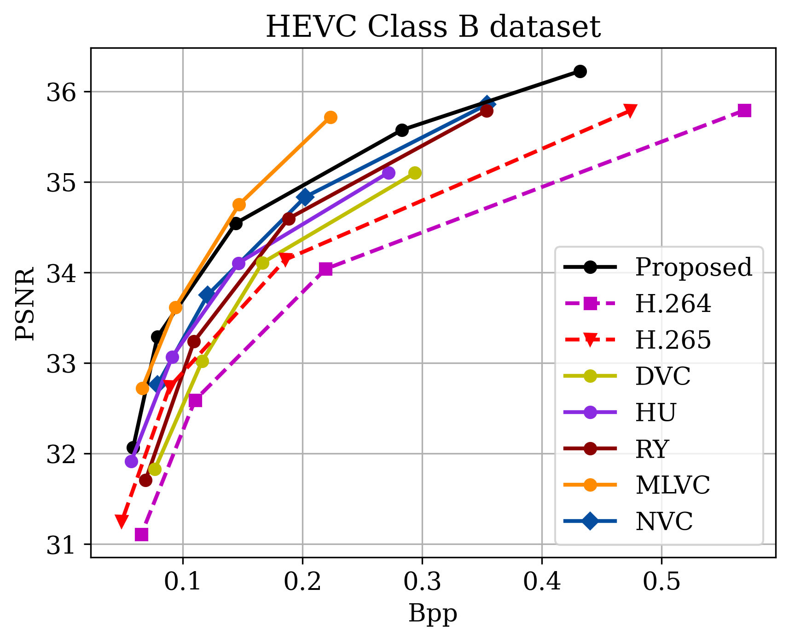
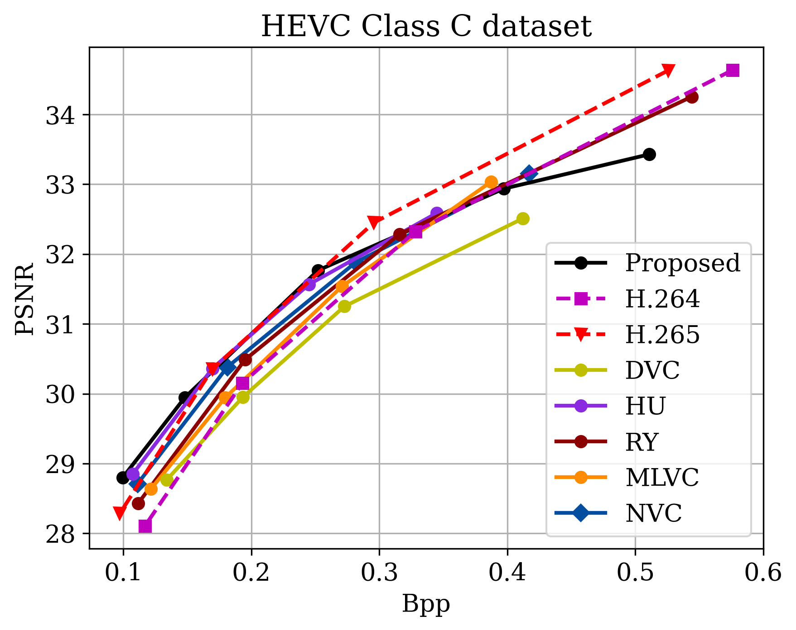
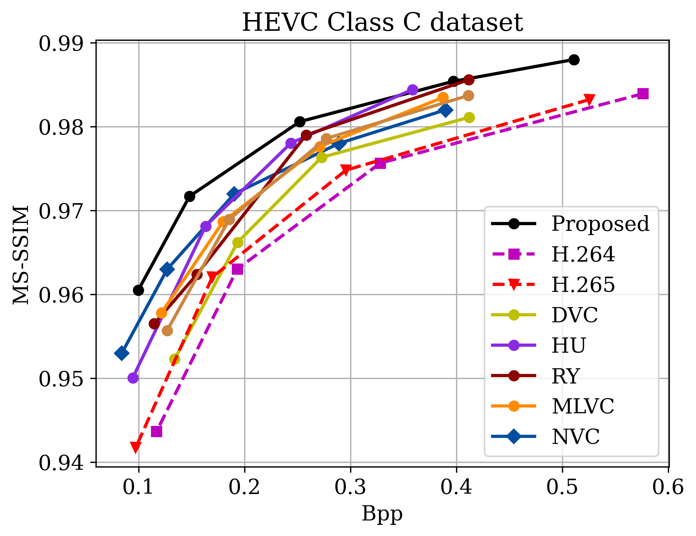
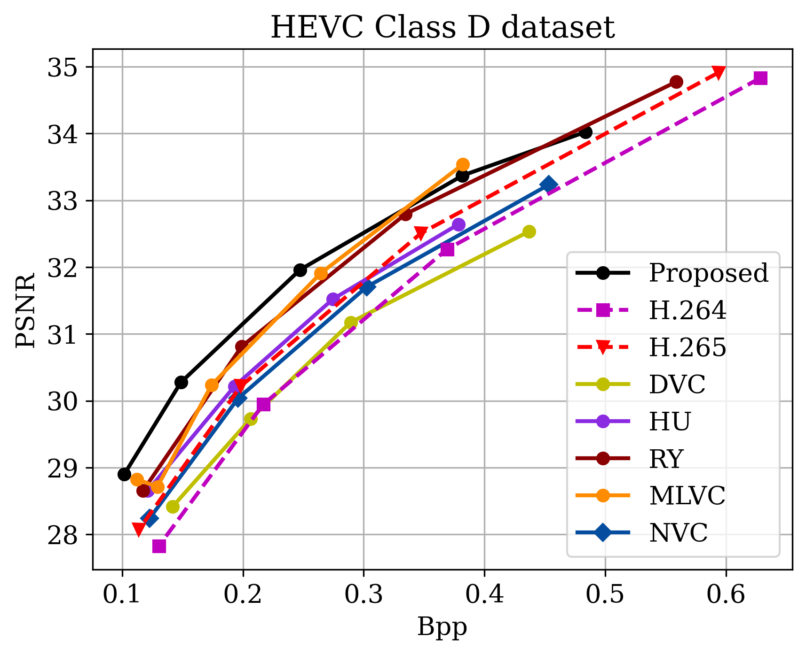
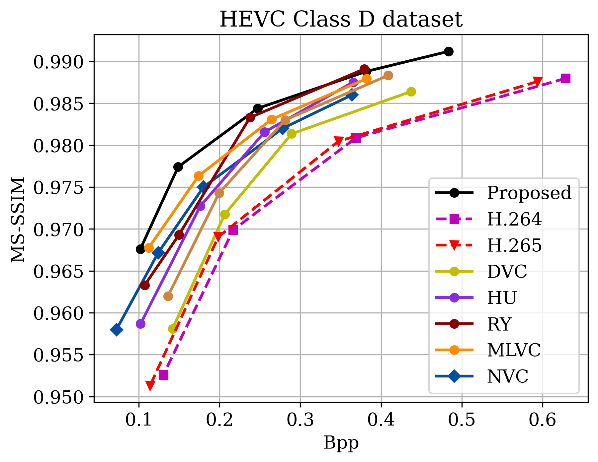

## Introduction
This is project page for the paper: "Liu C, Sun H, Katto J, et al.Learned Video Compression with Residual Prediction and Loop Filter", which is in submission.

If you have any question or find any bug, feel free to contact: 
Chao Liu@Fudan University, 
chaoliu18@fudan.edu.cn

## Environment settings
It is recommended to use Docker to build the environment.

1.  Pulling [pytorch-1.6](https://hub.docker.com/r/pytorch/pytorch) docker image.

        docker pull pytorch/pytorch:1.6.0-cuda10.1-cudnn7-runtime

2.  Creating docker environment.

        sudo nvidia-docker run -v $(pwd):$(pwd) -v /etc/localtime:/etc/localtime:ro -it -w $(pwd) pytorch/pytorch:1.6.0-cuda10.1-cudnn7-runtime

3.  Installing some necessary package.

        pip install scipy pytorch_msssim

4.  Installing [BPG](https://bellard.org/bpg/) for the coding of I-frames. We have already provided the compiled executables bpgenc and bpgdec in "./bin" folder, and you need to add the "./lib" to LD_LIBRARY_PATH before using them.

        export LD_LIBRARY_PATH=$(pwd)/lib:$LD_LIBRARY_PATH

## Downloading test sets and pre-trained models

The downloaded [pretrained models](https://drive.google.com/drive/folders/14KlBG9Hzxj9N54fcISqyA4F97k91VU2v?usp=sharing) and the input videos should be placed in the pretrained and datasets folder. Here we have given the models and the [HEVC Class C, D Datasets](https://drive.google.com/drive/folders/1eig9qBw7qS60fNJvAqjmfsVv60DotX94?usp=sharing) on Google Cloud Drive.

We have cropped the dataset to the multiples of 64 to allow the model compress and decompress the dataset directly, following the similar manner in [OpenDVC](https://github.com/RenYang-home/OpenDVC) and [MLVC](https://github.com/JianpingLin/M-LVC_CVPR2020).

    ffmpeg -s WxH -pix_fmt yuv420p -i input_video.yuv -vframes N -vf crop=W_:H_:0:0 -f image2 output_path/img%06d.png
where W, H denotes the width and height of the input sequence. Notation W_, H_ denotes the cropped width and height of the output one, and N denotes the number of frames to be coded.

## Testing
The testing consists of two main steps: encoding and decoding.

1.  Encoding

        python test.py --model 0 --qp 27 --verbose 1 --gpu 0 --encode True
2.  Decoding

        python test.py --model 0 --qp 27 --verbose 1 --gpu 0 --decode True
In order to ensure the correctness of coding, it is also important to check the matching of encoding and decoding results.

-   Mismatch Check

        python test.py --check True
-   All the three can also be executed at once

        python test.py --model 0 --qp 27 --verbose 1 --gpu 0 --encode True --decode True --check True

Parameter Descriptions
Params. |Type|Default|Range| Descriptions
:-:|:-:|:-:|:-:|:-
model |Int|0|[0, 4]| Index of the model, the larger the index the higher the reconstructed quality.
qp |Int|22|[0, 51]|QP value of BPG used for the 1-st I-frame coding.
verbose |Int|1|[0, 2]|log level. 0 - Class-level log; 1 - Video-level log; 2 - Frame-level log.
gpu |Int|0|[0, 3]|Index of the GPU for testing. The range of this param depend on your machine.
encode |Bool|False|False, True|Start encoding Flag.
decode |Bool|False|False, True|Start decoding Flag.
check |Bool|False|False, True|Start checking Flag.

The bitrate allocation between I, P frames can be flexible, and here we give some recommended QP values of BPG as shown in follow.

Model Index| BPG QP
:-:|:-:
0,1,2 |27
3,4 |22

## Experimental Results
The class results were obtained by averaging the coding results for each sequence.

(*Because of software version differences, the reproduced results of this project may be slightly different from the results in the figures.)

## Acknowledgment
This project is based on [CompressAI](https://github.com/InterDigitalInc/CompressAI) and [PyTorchVideoCompression](https://github.com/ZhihaoHu/PyTorchVideoCompression).

Thanks to Haojie Liu@Nanjing University and Zhihao Hu@Beihang University for their valuable help in this project.